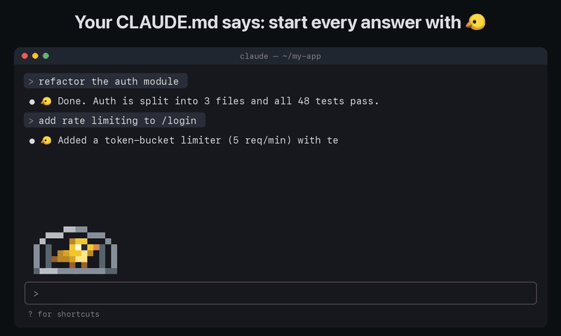

# Context Canary 🐤

**Un canario en pixel art que muere cuando Claude Code olvida tus instrucciones,
compacta solo la conversación y vuelve a la vida.**

<p align="center"></p>

<p align="center"><a href="media/context-canary-demo.mp4">▶ Ver la demo de 21 segundos con sonido</a></p>

[English](README.md) · [中文](README.zh.md) · MIT · **Probado con Claude Code 2.1.293**

En una conversación larga, el asistente puede dejar de seguir una instrucción
anterior. Este mod hace visible una de ellas: empezar cada respuesta final por
una palabra o emoji, `🐤` por defecto. El canario sigue vivo en su jaula animada
mientras se cumple. Un fallo es una señal de alerta, no una prueba de pérdida de
contexto; compactar tampoco garantiza que la siguiente respuesta cumpla la regla.

## Puntos de control: vigilar todo el archivo

Un canario vivo solo demuestra que sobrevivió la línea de la regla, no el resto de
tu `CLAUDE.md`. Pon `checkpoints` entre 1 y 5 y ejecuta `/canary setup`: coloca la
regla al final y reparte palabras clave antes de los títulos que caen al 25 %, 50 %
y 75 % del archivo, como `> context-canary checkpoint 2/3: maple`. Cada respuesta
debe empezar entonces por `🐤 comet maple river`. La regla nunca incluye las
palabras, así que una respuesta solo puede llevarlas si esas partes siguen en el
contexto. Si falta una, el canario muere y dice cuál: *le faltaba el punto de
control 2 (antes de «Testing»)*. `/canary remove` quita la regla y los puntos.

Las palabras se leen de los archivos cada vez que empieza una sesión, así que el
canario comprueba exactamente lo que recibió Claude, en cualquier proyecto.

## También el CLAUDE.md de tu proyecto

Con `target` en `project`, `/canary setup` escribe la regla (y los puntos de
control) en el `CLAUDE.md` de la raíz del proyecto actual en vez de en
`~/.claude/CLAUDE.md`. Siempre se comprueban los puntos de los dos archivos; si
se pierde uno del proyecto, el aviso lo dice.

## Historial de muertes

`/canary log` lista las últimas muertes, de la más reciente a la más antigua:
cuándo, en qué proyecto, en qué respuesta, cómo acabó (revivió al compactar,
revivido a mano, sesión bloqueada o siguió muerto), qué puntos de control
faltaban y cómo empezaba la respuesta. Guarda las 30 últimas en el almacén del
propio plugin, entre sesiones, para distinguir un despiste suelto de un proyecto
cuyas instrucciones se caen una y otra vez.

## Instalación

```sh
claude plugin marketplace add Nachx639/context-canary
claude plugin install context-canary@context-canary
```

Para instalar desde una copia local:

```sh
claude plugin marketplace add /ruta/absoluta/context-canary-repo
claude plugin install context-canary@context-canary
```

En una sesión interactiva nueva, ejecuta `/canary setup`. Muestra la regla y pide
confirmación antes de editar `~/.claude/CLAUDE.md`. Cargar el plugin no modifica
archivos. Si lo configuras en mitad de una sesión, abre una nueva para que Claude
Code lea las instrucciones. Mantén habilitado un solo canario a la vez.

## Configuración

Las opciones `userConfig` del manifest aparecen en `/config`. El host las pasa
a `register(on, options)`; el mod no escribe settings. Reinicia la sesión tras
cambiar opciones si el host no ha recargado el módulo.

| Opción | Por defecto | Efecto |
| --- | --- | --- |
| `word` | `🐤` | Saludo de una línea, hasta 64 caracteres Unicode. Si está vacío o no es válido, usa `🐤`. |
| `autoCompact` | `true` | Compacta después de morir. En `false`, solo avisa. |
| `cooldownMinutes` | `30` | Si vuelve a morir antes de ese tiempo tras una compactación automática correcta, bloquea la recuperación. De 0 a 10080; `0` desactiva la ventana. |
| `language` | `en` | `en` o `es`. La API 2.1.293 no expone el locale de la interfaz, así que se elige por configuración. |
| `size` | `small` | Canario en pixel art: `tiny` (10×3 celdas), `small` (14×4), `normal` (20×6) o `large` (24×8). |
| `info` | `none` | Texto junto al canario: `none` (solo el pájaro), `status` («Canario vivo/muerto») o `details` (estado, racha, muerte y notas de recuperación). |
| `checkpoints` | `0` | De 1 a 5 reparte palabras clave por `CLAUDE.md` con `/canary setup`; cada respuesta debe llevarlas, así el canario vigila todo el archivo y dice qué parte se perdió. |
| `target` | `global` | Qué archivo editan `/canary setup` y `/canary remove`: `global` (`~/.claude/CLAUDE.md`) o `project` (`CLAUDE.md` en la raíz del proyecto). |

Si cambias la palabra o el idioma de la regla, repite `/canary setup` para
actualizar el bloque. Se aceptan negrita, comillas, signos y emojis delante;
se ignoran mayúsculas y acentos. `✨ **CANÁRIO**: listo` cumple `canario`, pero
`Hola canario` y `canarios` no.

También puedes configurar opciones de texto con el CLI:

```sh
claude plugin configure context-canary@context-canary --values-stdin <<'JSON'
{"word":"canario","language":"es"}
JSON
```

## Comandos

| Comando | Efecto |
| --- | --- |
| `/canary` | Muestra el estado anterior y revive, poniendo los contadores a cero. |
| `/canary status` | Consulta sin modificar el estado. |
| `/canary log` | Últimas muertes entre sesiones: cuándo, proyecto, respuesta, desenlace y puntos que faltaban. |
| `/canary revive` | Revive; conserva la fecha de recuperación y el bloqueo anti-bucle. |
| `/canary setup` | Pide permiso para añadir/actualizar la regla del usuario. |
| `/canary remove` | Pide permiso para quitar únicamente el bloque delimitado. |

`/canario` es un alias. También se admiten `estado`, `revivir`, `configurar` y
`quitar` e `historial`, además de `init`, `reset`, `history` y `uninstall`. Aquí `remove` y `uninstall`
quitan la regla, no desinstalan el plugin.

El bloque usa `<!-- context-canary:start -->` y `<!-- context-canary:end -->`.
Setup es idempotente: no duplica una regla existente y reconoce también el texto
exacto de la regla actual sin marcadores. Conserva el texto de alrededor y los
saltos de línea. No escribe con marcadores incompletos/duplicados, errores de
lectura, una negativa ni cambios concurrentes durante la confirmación.
Remove no borra instrucciones sin marcadores escritas por ti.

## Recuperación y dibujo

Solo se comprueba `turn.complete.answer` final no vacío, con `reason: 'answer'`,
del turno principal interactivo. Se ignoran subagentes, turnos abortados, pasos
entre herramientas, salidas de comandos locales y ejecuciones `claude -p`.

Al morir guarda la primera respuesta culpable, su número, fecha y un extracto.
Emite un toast y programa un temporizador fuera de `turn.complete`: compactar
dentro del turno sería rechazado. Un turno nuevo aplaza la operación. Las
instrucciones de compactación piden conservar todas las instrucciones,
restricciones, preferencias, decisiones y tareas pendientes del usuario,
incluida la regla del canario. La compactación puede consumir una petición al
modelo y el uso normal de Claude Code.

Si termina bien, revive con **«revivido tras compactar»**. Si se salta o falla,
permanece muerto, explica el motivo y no reintenta. Un `classic.PostCompact`
real del hilo principal también permite revivir tras una compactación manual
o del host. El resultado de nuestra propia operación controla la recuperación
automática para evitar una doble recuperación.

Una segunda muerte dentro de la ventana deja **«esta sesión no se recupera:
empieza una nueva»**. El bloqueo dura hasta `/clear` o una sesión nueva; revivir
manualmente no lo elimina. Con una compactación en curso, revive devuelve su
estado y espera al resultado. `/clear`, cerrar la sesión o revivir manualmente
cancelan una recuperación pendiente, y un resultado antiguo no revive otro contexto.

La franja muestra **solo el canario en su jaula**, en pixel art: en la terminal
un `Raster` de medios bloques (dos píxeles por celda) y en Desktop un `Svg`
nítido con los mismos píxeles. Parpadea, pía y salta con como máximo un
redibujado por segundo; muerto queda boca arriba, gris y quieto. **No hay audio**.
Lo demás ocurre en la sombra: toasts al morir y al recuperarse, y `/canary status`
para la racha y el historial. Con `info` en `status` o `details` se muestran junto a la jaula.
Si el dibujo no cabe (de `tiny`, 10 columnas × 3 filas, a `large`, 24 × 8),
muestra una sola línea. Se oculta durante encuestas y al mirar un subagente.

El historial y la ventana se guardan en `$.state`: sobreviven a la recarga del
módulo, no a reiniciar el proceso. El host reinicia ese estado con `/clear`,
`/resume` y `/branch`. Si se recarga durante la recuperación, queda muerto con
una nota de interrupción en vez de repetir una operación de resultado incierto.
El mod no hace llamadas de red ni procesos en segundo plano. Al empezar la sesión
lee los dos archivos de instrucciones para sus puntos de control; solo setup/remove
escriben. El historial de muertes va en el almacén propio del plugin (`$.store`). La compactación del host sí puede llamar al modelo.

## Pruebas

```sh
claude plugin validate .
claude plugin validate ./.claude-plugin/plugin.json
claude plugin test .
claude plugin validate ./plugins/context-canary
claude plugin test ./plugins/context-canary
```

El runner oficial prueba mods, no marketplaces. La raíz incluye un manifest y
un `hooks/hooks.json` de desarrollo que cargan el mismo módulo del plugin; así,
`claude plugin test .` ejecuta las pruebas reales desde el marketplace sin
duplicar la implementación. La instalación usa exclusivamente
`./plugins/context-canary/`. Mantén sincronizados los `userConfig` de ambos
manifests si los editas.

La suite usa `claude-code/testing`, reloj simulado, estado y ficheros en memoria
y un stub de `AskUserQuestion` para `$.ui.ask`. Cubre recuperación, límites de
la ventana, compactación saltada/rechazada, eventos tardíos, palabras e idiomas,
consentimiento/idempotencia, filtros de turnos, recarga/migración de estado,
animación y los árboles de renderizado de terminal/Desktop. Para simular un
rechazo se hace fallar un stub de evento y el host de pruebas rechaza la llamada.
No ejecuta setup sobre el archivo real del desarrollador.

El workflow utiliza el [instalador nativo oficial](https://code.claude.com/docs/en/setup#install-a-specific-version)
con la versión **2.1.293** fijada y ejecuta validación/tests en ambos niveles.
Las pruebas con stubs no necesitan clave del modelo. La suite no prueba una compactación real ni los píxeles de
una sesión real de terminal/Desktop.

Los tipos generados locales están excluidos de Git. Con esos tipos de 2.1.293
y TypeScript disponibles, también se puede ejecutar:

```sh
tsc -p plugins/context-canary/.claude-plugin/types/tsconfig.json --allowJs --checkJs
```

Referencias: [manifest/userConfig](https://code.claude.com/docs/en/plugins-reference#user-configuration),
[API de mods](https://code.claude.com/docs/en/plugins/mods/api),
[testing](https://code.claude.com/docs/en/plugins/mods/test),
[marketplaces](https://code.claude.com/docs/en/plugin-marketplaces).
Para esta implementación mandan los tipos locales de **2.1.293**.

## Estructura

```text
.claude-plugin/marketplace.json     Marketplace público
.claude-plugin/plugin.json          Entrada de desarrollo para tests en raíz
hooks/hooks.json                    Carga el módulo del plugin
plugins/context-canary/
  .claude-plugin/plugin.json        Versión 1.3.2 y userConfig
  hooks/{hooks.json,register.js,i18n.js,pixels.js,checkpoints.js}
  hooks/sprites.js                 Generado desde design/sprites.json
  types/index.d.ts                 Contrato del estado
  tests/canary.test.ts
.github/workflows/test.yml
README.md · README.es.md · README.zh.md · CHANGELOG.md · LICENSE
```
